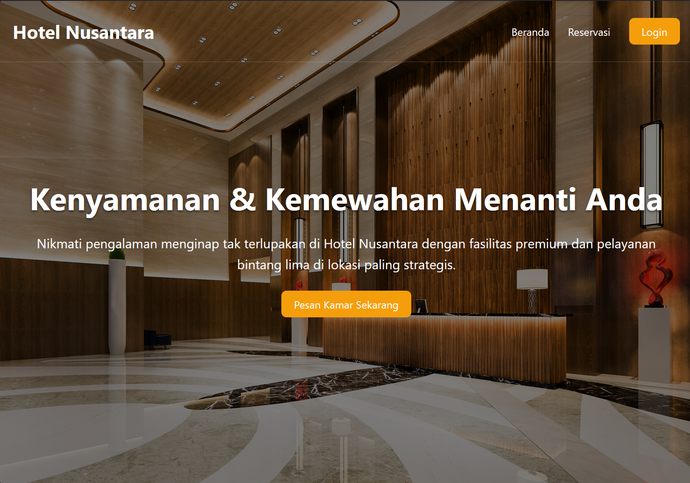

# 🏨 Website Hotel Nusantara

Ini adalah proyek website *front-end* statis untuk Hotel Nusantara. Website ini menampilkan halaman utama (landing page), fasilitas hotel, galeri interaktif, serta halaman login dan reservasi.



---

## ⚠️ Disclaimer

Proyek ini dibuat murni untuk memenuhi tugas **Ujian Tengah Semester (UTS)**. Website ini adalah **proyek non-komersial** dan **hanya untuk tujuan pendidikan**.

Informasi, alamat, dan data yang tertera (seperti riwayat reservasi) adalah fiksi. Aset gambar yang digunakan hak ciptanya dimiliki oleh pemilik aslinya dan digunakan di sini hanya sebagai bahan pembelajaran dan portofolio.

---

## 🚀 Fitur Utama

* **Halaman Utama:** Menampilkan *hero section*, fasilitas unggulan, lokasi, dan galeri.
* **Halaman Reservasi:** Formulir pemesanan kamar dengan tabel riwayat (statis).
* **Halaman Login:** Formulir login anggota.
* **Animasi Scroll:** Efek *fade-in* (muncul perlahan) pada elemen saat di-*scroll* menggunakan `IntersectionObserver`.
* **Galeri Interaktif:** Efek *hover* (zoom, overlay, dan teks) pada gambar di galeri.
* **Validasi Form:** Validasi JavaScript untuk memastikan tanggal *check-out* tidak lebih awal dari *check-in*.

---

## DEMO

Anda dapat melihat *live demo* proyek ini di: **https://agungprasastia.github.io/Website-Hotel/**

---

## 🛠️ Teknologi yang Digunakan

Proyek ini dibangun menggunakan teknologi web standar (front-end):


---

## 🏃‍♂️ Cara Menjalankan

Anda tidak perlu instalasi apa pun untuk menjalankan proyek ini. Cukup ikuti langkah-langkah berikut:

1.  **Clone repository** ini ke komputer lokal Anda:
    ```bash
    git clone [https://github.com/agungprasastia/Website-Hotel.git](https://github.com/agungprasastia/Website-Hotel.git)
    ```

2.  **Masuk ke folder** proyek:
    ```bash
    cd Website-Hotel
    ```

3.  **Buka file `index.html`** di browser favorit Anda.

---

## 🧑‍💻 Pembuat

Dibuat oleh **Agung Prasasti Abadi**.